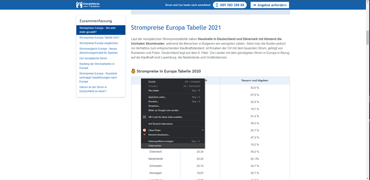
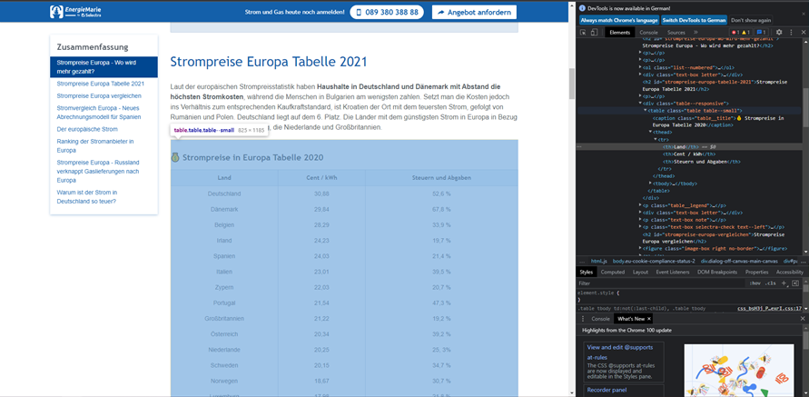

# Web crawler
Web crawlers are also called searchbots, spiders or robots. The term refers to a computer program that is able to automatically search the Internet for specific information and data. The data can then be evaluated, sorted according to specified criteria and stored. 

This web crawler is used to extract data and information related to energy. 

### 1. Libraries 📚
In the requirements.txt file you will find all the libraries used for the project. The most important libraries are briefly described below:

- **BeautifulSoup4: extract website information** 
  - Beautiful Soup enables the user to extract information from web pages. It relies on an HTML or XML parser and provides Pythonic idioms for iterating, searching and modifying the parse tree.
- **requests: asking for permission from the hosting server**
  - It obtains the hosting server's permission if we want to retrieve data from its website
  - If the output is <Response [200]>, it means that the server allows us to collect data from its website. 
- **pandas: creating a dataframe**
  - Pandas is used to create a data frame in the form of a table for downloaded data.
- **lxml: changing the HTML format into a Python-friendly format**
  - The lxml library helps to process HTML in the Python programming language.
- **urllib.request: handling URLs**
  - It is used for retrieving URLs (Uniform Resource Locators). Using the urlopen function, it can retrieve URLs over a variety of different protocols.
- **colorama: providing colored text output**
  - With colorama, text on the console can be colored, which increases the readability.

#### Installation of libraries 
Some libraries require installation via the command prompt and cannot be installed just by fulfilling the requirements in the requirements.txt file. The following steps show how to install such libraries.
1. **BeautifulSoup4:** 
    - open the command prompt and type the following command:pip install beautifulsoup4
2. **urllib.request**
    - open the command prompt and type the following command: pip install urllib

### 2. Classes 📁
In the following, you find a description of which classes are implemented and what functions they contain.

- **Class "Crawler": Allows the user to navigate through a main menu where he/she can choose one of the following options:**

  - "Test whether the website you want to crawl allows web crawling" 
  - "Extract links from a website"
  - "Extract a table from a website"
  - "Extract text from a website"
  - "Extract images from a website"
  - "Exit"

  ℹ️ For a better understanding of these options, please read Chapter 3.
 
 
 
- **Class "Content": Contains information about the content structure** 

- **Class "Website": Contains information about website structure that is needed for web crawling**

### 3. Options
  - "Test whether the website you want to crawl allows web crawling": Web scraping is not illegal per se, but the problem is when it is used without the permission of the website owner and in violation of the terms of use. Therefore, before crawling a website, it is important to obtain permission from the hosting server to retrieve data from its website. If you are using this feature, after entering the URL, the web crawler will tell you either 'This is a safe website, you can start web crawling now.' or 'I am sorry, you are not allowed to crawl this website. Try another one.' if it is not allowed. 

  - "Extract links from a website": Allows the user to extract both external and internal links from a website. The individual links are then displayed in the console. For better clarity, the internal links are colored green and external links in a light black. Afterwards the user has the option to save the links in a csv file. If the user chooses to do so, he or she will find this file in the folder Data/links with the current date and time as file name. 

  - "Extract a table from a website": This function is suitable for downloading tables from websites. The data of the table is displayed in an Excel file, which is then saved under Data/tables. To use this function, it is important to know the HTML code of a website. Here is a brief instruction: 
  
    1.  Please make a right click on the table of a website. Then select "Untersuchen" (view page source).
    
    
    
    2. To extract the table from the website, the location of the table must be determined, i.e. the class of the table from the tag <table>. The class is then passed to the web crawler.
  
    
  
  ℹ️ In some cases it might me necessary to adapt the code, e.g. when the column's tag is not <th>
